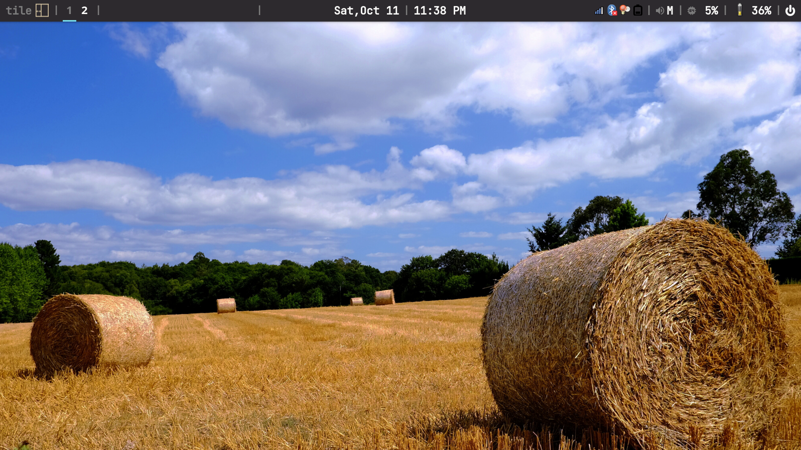

<h1 align="center">dotfiles</h1>



<p align="center">
    <b>Screenshots</b><br>
    <a href="https://github.com/mbvgua/dotfiles/blob/main/images/nvim.png">Neovim</a>&nbsp;&nbsp;&nbsp;
    <a href="https://github.com/mbvgua/dotfiles/blob/main/images/apps.png">Apps</a>&nbsp;&nbsp;&nbsp;
</p>

## Why?

Every time I got a new machine, I’d dive straight into tweaking(changing themes, adding icons, adjusting settings, downloading my preferred apps) all just to make it feel right. But it was always messy and inconsistent. That all changed when I discovered Vim, and how easy it was to configure with just a `.vimrc` file. It opened my eyes to the idea that my environment could be scripted, repeatable, and fully mine.

That led me down the rabbit hole to a deeper realization; in Linux, everything is a file. Dotfiles became my way of capturing those preferences in a clean, version-controlled setup I could carry anywhere. ~~NixOs~~ Dots are reproducible to the core. No more starting from scratch! Just clone, symlink, and go.

## What?

- CLI
    - [wezterm](https://github.com/wezterm/wezterm) - A GPU-accelerated cross-platform terminal emulator and multiplexer written and implemented in Rust .
    - [bash](https://cgit.git.savannah.gnu.org/cgit/bash.git) - Bash is an interactive command interpreter and programming language developed for Unix-like operating systems.
    - [tmux](https://github.com/tmux/tmux) - A terminal multiplexer.
    - [neovim](https://github.com/neovim/neovim) - Hyperextensible Vim-based text editor.
    - [git](https://github.com/git/git) - A free and open source distributed version control system.
        - [diff-so-fancy](https://github.com/so-fancy/diff-so-fancy) - Make your diffs human readable instead of machine readable.
    - [htop](https://github.com/htop-dev/htop) - An interactive process viewer.
    - [fzf](https://github.com/junegunn/fzf) - A command-line fuzzy finder.
    - [ripgrep](https://github.com/BurntSushi/ripgrep) - A line-oriented search tool that recursively searches directories for a regex pattern.
    - [wget](https://cgit.git.savannah.gnu.org/cgit/wget.git) - A free software package for retrieving files using HTTP, HTTPS, FTP, and FTPS.
    - [feh](https://github.com/derf/feh) - a fast and light image viewer.
    - [ranger](https://github.com/ranger/ranger) - a VIM-inspired filemanager for the console .
    - [ytdlp](https://github.com/yt-dlp/yt-dlp) - a feature-rich command-line audio/video downloader.
    - [keyd](https://github.com/rvaiya/keyd) - a key remapping daemon for linux.
    - [eza](https://github.com/eza-community/eza) - a modern alternative to ls.
    - [curl](https://github.com/curl/curl) - a command-line tool for transferring data specified with URL syntax.
    - [stow](https://www.gnu.org/software/stow/) - a symlink farm manager, to store and sync your configuration files in one common location.
    - [nm-applet](https://gitlab.gnome.org/GNOME/network-manager-applet) - tray applet and an advanced network connection editor.
    - [blueman-applet](https://github.com/blueman-project/blueman) - a GTK+ Bluetooth Manager.
    - [paplay](https://linux.die.net/man/1/paplay) - play back audio files on a PulseAudio sound server.
- GUI
    - [qtile](https://github.com/qtile/qtile) - An X11/Wayland tiling window manager.
    - [rofi](https://github.com/davatorium/rofi) - A window switcher, application launcher and dmenu replacement.
    - [dunst](https://github.com/dunst-project/dunst) - A highly configurable and lightweight notification daemon.
    - [picom](https://github.com/yshui/picom) - A lightweight compositor for X11.
    - [sublime Text](https://www.sublimetext.com) - A sophisticated text editor for code, markup and prose.
    - [flameshot](https://github.com/flameshot-org/flameshot) - powerful yet simple to use screenshot software.
    - [mpv](https://github.com/mpv-player/mpv) - command line media player.
    - [redshift](https://github.com/jonls/redshift) - Redshift adjusts the color temperature of your screen according to your surroundings. This may help your eyes hurt less if you are working in front of the screen at night.
    - [zathura](https://pwmt.org/projects/zathura) - a highly customizable and functional document viewer. It provides a minimalistic and space saving interface as well as an easy usage that mainly focuses on keyboard interaction.
    - [nautilus](https://gitlab.gnome.org/GNOME/nautilus) - this is the project of the Files app, a file browser for GNOME, internally known by its historical name `nautilus`.
    - [marktext](https://github.com/marktext/marktext) - a simple and elegant markdown editor.

## How?

Currently, these dots work neatly on fedora systems, if you have another OS, please change the package manager in the [install.py](./install.py) file accordingly; though not all the packages may be present in the official repositories.

To get this up and running, simply navigate to your `$HOME` directory and:
```bash
    git clone https://github.com/mbvgua/dotfiles.git ~/.dotfiles
    cd ~/.dotfiles
    python install.py

    # create symlinks to necessary files
    stow .
```
> [!IMPORTANT]
> It might be a good idea to back up existing files of the same name as they will be replaced. A good place to customize would be the `.gitconfig` file, change existing variable names to yours
> 
> A neccessary QoL if you are on the `qtile` WM is adding click support, which allows for click actions using the touchoad. Simply navigate to the `/usr/share/X11/xorg.conf.d/40-libinput.conf` file and add the "Option" "Tapping" "true" in the below class:
> 
> ```bash
> Section "InputClass"
>         Identifier "libinput touchpad catchall"
>         MatchIsTouchpad "on"
>         MatchDevicePath "/dev/input/event*"
>         Driver "libinput"
>         Option "Tapping" "True" # this option here
> EndSection
> ```

## So it begins!
<!--- So it begins young Padawan! --->

<p align="center">
If you only knew the power of the dark side. <br>
    Darth Vader.
</p>

## May I?

[If you insist...](./LICENSE)

